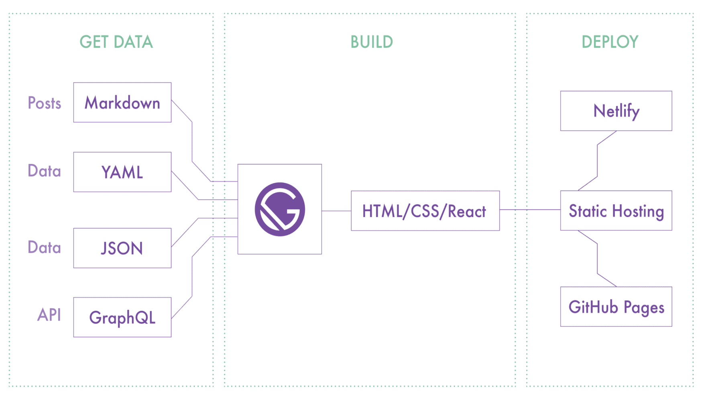

Gatsby is a very powerful static website generator with some of the most popular technologies in the market.

It is powered by React, react-router, webpack, sass, GraphQL just to mention some, but more importantly a huge and very active community with a great plugin ecosystem.

## But, what's an static site generator?

Static sites is a way of building a site were most the parts are generated at build time instead of runtime.

The HTML, JS, CSS and all the assets are generated for every (or most of them) possible page to improve speed of loading.

In a space dominated by [Jekill](https://jekyllrb.com/),  Gatsby applies this philosophy using javascript technologies, specifically the [JAMStack](https://jamstack.org/), React for building the interface and GraphQL for querying information from it's data sources.

In contrast, dynamic sites like Wordpress technology, a web page it's generated on demand, usually querying a database.  

## A Gatsby Application

Basically how a gatsby application works is creating and in memory database that can be accessed via the GraphQL API to generate all the site pages.
This pages can be built around templates of React Components or simply transforming data sources into HTML files.

When the website is build, gatsby generates static HTML, CSS and JS files per each one of the pages of the site ready to be deployed in a web server or cloud.
 
The Architecture of a gatsby application is focused on three major elements:
 

### 1. The Data Layer

Gatsby uses a plugin system to provide a wide set of tools to obtain data from different sources like: Other cms, formatted files (json, md, xml), API's, and many more, to populate its database.

The plugins are extensible and highly configurable to provide flexibility in how to query and access the information.

### 2. The View Layer

The HTML interface is built using React, and all the technologies available in a webpack build system, like: SASS, LESS, FONTS, etc

As mention before the `build` phase of gatsby transform all the source site into static HTML files.

### 3. The static site

HTML, CSS and JS files are generated for all the pages on the site, compatible with any standard web server ready to be deployed.

## Main Features:
    
    1. Cacheable content
    2. Can be hosted by any webserver system
    3. Enhanced in build time by the plugin ecosystem: image, css, etc
    4. Javascript based
    5. Asset pipeline 
    6. AMP Support

[Complete List of Features](https://www.gatsbyjs.org/features/)

## Gatsby Hello World:

Assuming that you have `node`, `npm` and `git` installed

1. Install Gatsby

`npm install --global gatsby-cli`

2. Create a new site from an starter (there are dozens)

`gatsby new hello-world https://github.com/gatsbyjs/gatsby-starter-hello-world`

3. Start developing

`cd hello-world`

`gatsby develop`

## Some use Cases

### [Website](https://github.com/cobuildlab/cobuildlab-web)

### [Blog](https://github.com/workinblocks/workinblocks-website)

